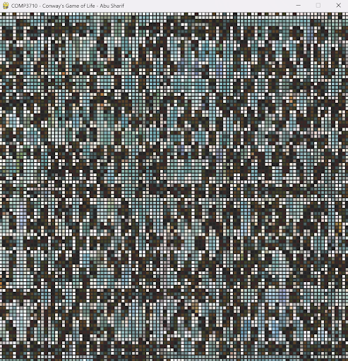
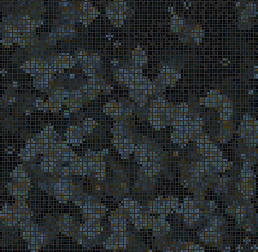

Conway’s Game of Life — Image-Based Computational Art
Exploring cellular automata with image-based art

🧩 Overview

This project transforms static images into evolving, colorful cellular automata using Conway’s Game of Life.
Each image pixel becomes a cell that lives, dies, or fades over time—creating algorithmically generated art that reflects the original image’s color composition while evolving organically with each generation.

🖼️ Sample Output
Andalusian Tilework Pattern 
|                                                                       **Original Image**                                                                       |                                                                  **Grid Conversion**                                                                  |                                                               **After 50 Generations**                                                               |
| :------------------------------------------------------------------------------------------------------------------------------------------------------------: | :---------------------------------------------------------------------------------------------------------------------------------------------------: | :--------------------------------------------------------------------------------------------------------------------------------------------------: |
|  |  |  |
|                                                            *Imported BMP image used as the source.*                                                            |                                         *Each pixel mapped to an alive/dead cell with preserved color values.*                                        |                                           *Evolving geometry inspired by traditional Andalusian tilework.*                                           |

🎞️ Full Evolution (Animated)

Key Features:

🖼️ Image-to-Grid Conversion: Converts BMP images into a fixed-size cellular automata grid.
🎨 Color-Aware Evolution: Uses dominant colors from the source image for live cells.
💡 Dynamic Fading: Dead cells gradually fade, giving a painterly “dissolve” effect.
⚙️ Pure Python Implementation: Manual BMP parsing—no external image-processing libraries used.
🧠 Real-Time Visualization: Interactive simulation built entirely with PyGame.
🧩 Scalable & Modular: Clean separation of components (image parsing, color logic, visualization).

How It Works:

1. Image Input (BMP Only) – The image is read byte-by-byte to extract pixel and header data.
2. Grid Initialization – Brightness levels determine if a pixel starts as alive or dead.
3. Dominant Color Extraction – The most frequent non-background colors are identified and stored.
4. Evolution – The grid updates according to Conway’s rules with added color and fading logic:
   a. Alive cells with 2–3 live neighbors survive.
   b. Dead cells with exactly 3 live neighbors become alive, adopting a new dominant color.
   c. Dead cells gradually lose brightness with each generation.
5. Rendering – Each generation is drawn in PyGame at 60 FPS, displaying a smooth, colorful evolution.

Author:
Abubakar Sharif
